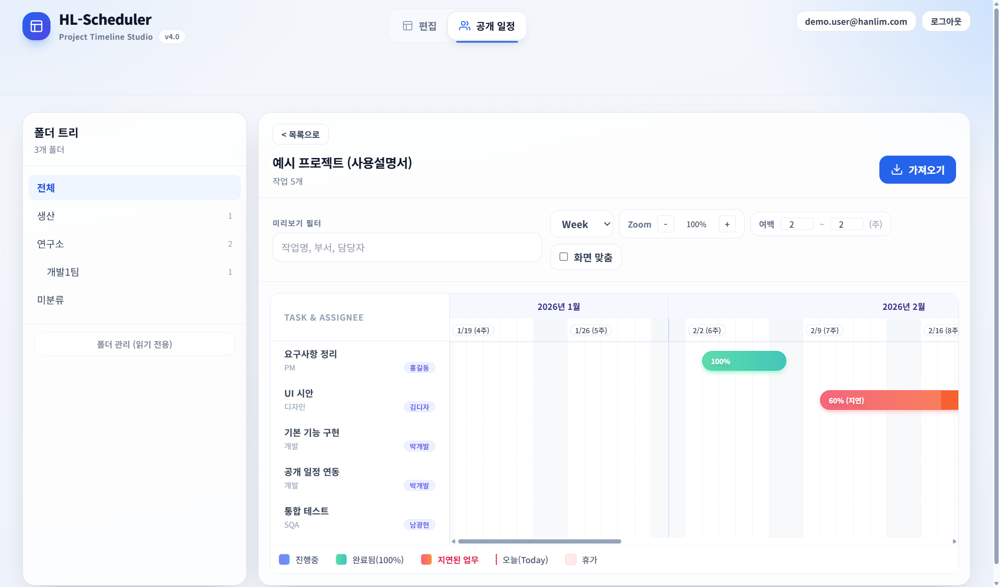
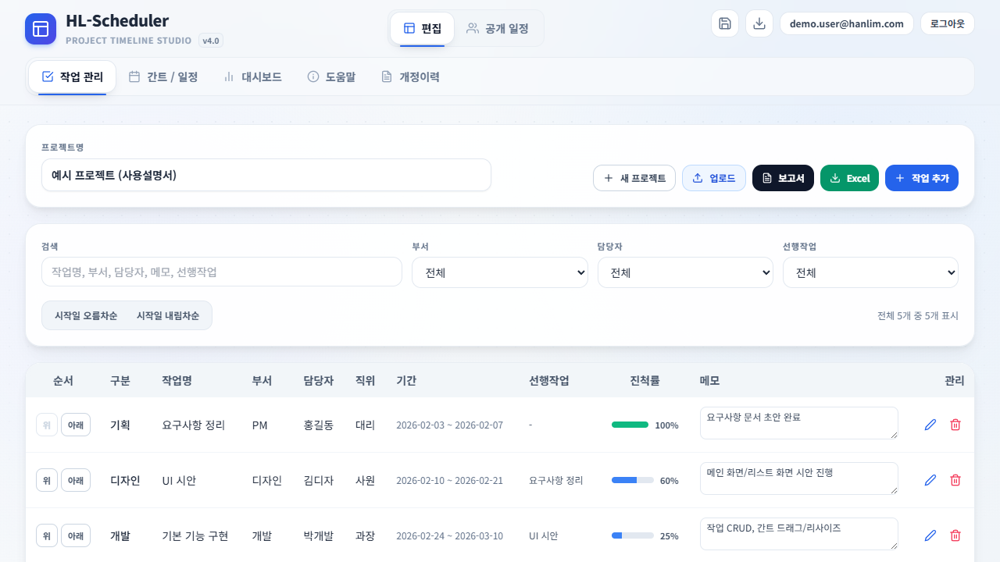
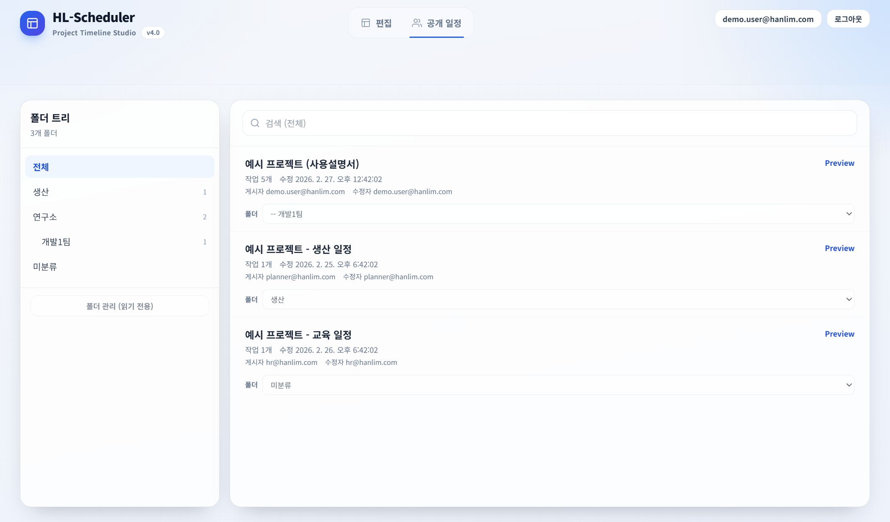

# HL-Scheduler (Rev.4 / v4.0.0)

React + Vite + Electron 기반의 일정/업무 스케줄러입니다.  
작업 관리(표)와 간트(Gantt) 차트를 함께 사용하며, 휴가/예외 일정 오버레이, 선행작업(의존성) 기반 자동 일정 보정, 내보내기(이미지/Word/Excel), JSON 백업/복원, 공개 일정 공유(서버 연동) 기능을 제공합니다.

- 초보자용 사용설명서(PDF): [`docs/user-manual/HL-Scheduler_UserManual_ko_v4.0.0.pdf`](docs/user-manual/HL-Scheduler_UserManual_ko_v4.0.0.pdf)
- 사용설명서(HTML): [`docs/user-manual/HL-Scheduler_UserManual_ko_v4.0.0.html`](docs/user-manual/HL-Scheduler_UserManual_ko_v4.0.0.html)

## 스크린샷

| 간트/일정 | 작업 관리 | 공개 일정 |
| --- | --- | --- |
|  |  |  |

## 주요 기능

- **작업 관리**: 작업 추가/수정/삭제, 담당자/부서/진척률, 메모
- **간트/일정**: Day/Week/Month 보기, 드래그로 이동/기간 조정, 확대/축소(Zoom), 화면 맞춤(Fit), 범위 여백(before/after)
- **휴가/예외 일정**: 간트 위 오버레이로 “제외 기간” 표시
- **의존성(선행작업)**: 선행작업 종료일 + 1일 이후로 후행작업 자동 보정(사이클 감지/경고)
- **대시보드**: 프로젝트 요약/통계(완료/지연 등)
- **내보내기**: 간트 이미지(PNG/JPG), Word 보고서(.doc), Excel(.xlsx)
- **백업/복원**: 프로젝트(JSON) 저장/불러오기(덮어쓰기)
- **공개 일정(서버 연동, 선택)**: 목록/폴더/검색/미리보기/가져오기, 업로드/업데이트, (Admin) 폴더/사용자 승인 관리

## 요구사항

- Node.js 18+

## 실행(개발)

### 1) 웹(브라우저) 개발 실행

```bash
npm install
npm run dev
```

- 접속: `http://localhost:5173`

### 2) 데스크톱(Electron) 개발 실행

Electron은 개발 중에는 Vite Dev Server URL을 환경 변수로 전달해 실행합니다.

1) 터미널 A: Vite 실행

```bash
npm run dev
```

2) 터미널 B: Electron 실행(PowerShell 예시)

```powershell
$env:ELECTRON_RENDERER_URL="http://localhost:5173"
.\node_modules\.bin\electron.cmd .
```

## 빌드

### 웹 빌드(Vite)

```bash
npm run build
```

### 포터블 EXE (오프라인 배포, Windows)

Windows에서 설치 없이 실행되는 단일 `exe`로 패키징합니다.

```powershell
npm run dist:portable
```

- 결과물: `release/Scheduler-4.0.exe`

## 테스트(간단 점검)

```bash
npm test
```

## 환경 변수(.env)

서버 연동(공개 일정/로그인/관리자 기능)이 필요하면 루트에 `.env`를 생성하고, `.env.example`를 참고해 값을 채우세요.

| 변수 | 용도 | 비고 |
| --- | --- | --- |
| `VITE_PUBLIC_SCHEDULES_API_BASE` | 공개 일정 조회 API Base | 없으면 공개 일정 기능 비활성화 |
| `VITE_PUBLIC_SCHEDULES_WRITE_API_BASE` | 공개 일정 쓰기 API Base | 비워두면 read base를 사용 |
| `VITE_AUTH_API_BASE` | 인증(register/login/me/logout) API Base | 비워두면 schedules base를 사용 |
| `VITE_ADMIN_API_BASE` | 관리자(user approval/reset) API Base | 비워두면 write base를 사용 |
| `VITE_APP_ROLE` | 앱 역할(`public`/`admin`) | 기본 `public` |
| `VITE_PUBLIC_APP_URL` | 로그인 후 이동용 URL | 선택 |
| `VITE_ADMIN_APP_URL` | 로그인 후 이동용 URL | 선택 |
| `VITE_SHARED_SCHEDULE_ID` | 공유 원본 일정 ID 고정 | 선택(설정 시 update-only 흐름에 사용) |

> 서버 연동을 사용하지 않아도 로컬 편집/백업/내보내기 기능은 사용할 수 있습니다.

## 서버(선택): 공개 일정/권한/폴더 (Cloudflare Workers + D1)

공개 일정 API 서버는 `server/public-schedules-worker`에 포함되어 있으며, 배포/환경 변수/권한 규칙은 해당 폴더의 문서를 참고하세요.

- 서버 문서: [`server/public-schedules-worker/README.md`](server/public-schedules-worker/README.md)

## 문서/스크린샷 자동 생성(개발자용)

사용설명서 PDF와 스크린샷은 Electron으로 자동 생성할 수 있습니다.

### 스크린샷 생성

```powershell
Remove-Item Env:\ELECTRON_RUN_AS_NODE -ErrorAction SilentlyContinue
.\node_modules\.bin\electron.cmd scripts\manual\generate-screenshots.cjs
```

- 출력: `docs/user-manual/images/*.png`

### PDF 렌더링

```powershell
Remove-Item Env:\ELECTRON_RUN_AS_NODE -ErrorAction SilentlyContinue
.\node_modules\.bin\electron.cmd scripts\manual\render-manual-pdf.cjs
```

- 출력: `docs/user-manual/HL-Scheduler_UserManual_ko_v4.0.0.pdf`

## 프로젝트 구조(요약)

- `src/`: React UI (작업 관리, 간트/일정, 대시보드, 공개 일정, 인증/관리자)
- `electron/`: 데스크톱 앱 메인/프리로드 (이미지 저장, 앱 확대/축소 등)
- `server/public-schedules-worker/`: 공개 일정/인증/관리자 API(Cloudflare Workers + D1)
- `docs/user-manual/`: 초보자용 사용설명서(HTML/PDF) 및 스크린샷
