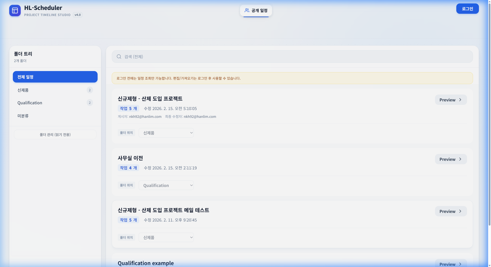
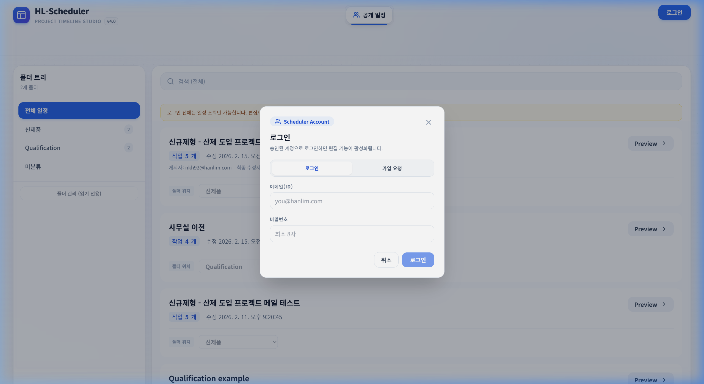
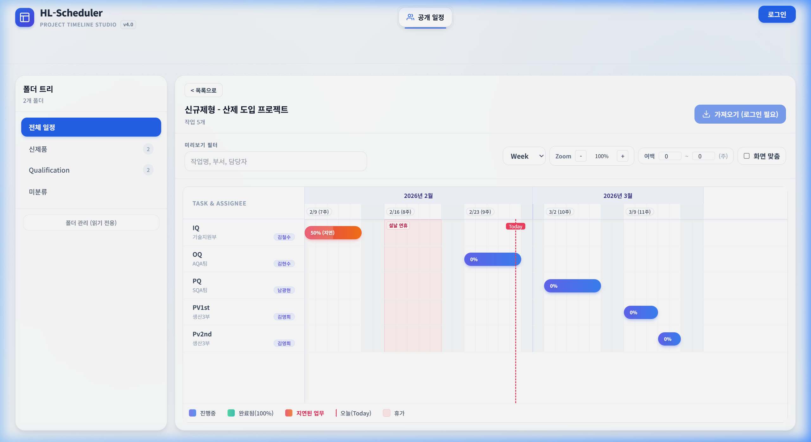

# 📅 HL-Scheduler: 초보자를 위한 사용자 매뉴얼

**프로젝트 타임라인 스튜디오(HL-Scheduler)** 에 오신 것을 환영합니다!  
누구나 이 매뉴얼을 따라하면 5분 만에 일정을 확인하고, 나만의 프로젝트를 손쉽게 등록 관리할 수 있습니다. 

---

## 1. 첫 화면 둘러보기 (공개 일정)
애플리케이션에 처음 접속하면 가장 먼저 나타나는 화면입니다. 이 화면에서는 다른 부서/팀원들이 작성해둔 일정을 검색하거나 확인할 수 있습니다.

### 📌 화면 구성 요소
*   **A. 폴더 트리 (좌측 화면)**: 회사 혹은 팀별로 분류된 "폴더"입니다. 원하는 부서명를 클릭하면, 해당 부서의 **일정만 모아서** 확인할 수 있습니다.
*   **B. 검색 바 (상단)**: 찾고 싶은 프로젝트의 이름이나 내용, 작성자를 입력하여 빠르게 일정을 검색합니다.
*   **C. 일정 목록 (중앙 카드)**: 현재 선택된 폴더 내의 프로젝트 목록입니다. 프로젝트의 이름, 상세 작업 개수, 수정 날짜, 게시자 정보가 시각적으로 분리된 **모던한 카드 형태**로 보여집니다.
*   **D. 로그인 버튼 (우측 상단)**: 더 강력한 기능(내 프로젝트 작성, 파일 내보내기/불러오기 등)을 사용하기 위해 필요합니다.

> 💡 **Tip:** 로그인 전에는 등록된 타인의 일정을 **[Preview(미리보기)]** 버튼을 통해 "조회"만 할 수 있으며, 수정은 불가능합니다.

---

## 2. 로그인 하기 (내 프로젝트 관리 준비)
파일 저장, 기존 일정 수정, 나만의 프로젝트를 작성하려면 **[로그인]**을 해야 합니다.

1.  우측 상단 메뉴의 파란색 **[로그인]** 버튼을 클릭합니다.
2.  로그인 창이 나타나면, 회사에서 발급된 **이메일 주소**와 **비밀번호**를 입력하고 [로그인]을 누릅니다.
3.  올바르게 입력하면 로그인 창이 닫히며, 화면 상단에 내 이름/부서가 나타나고, 숨겨져 있던 새로운 기능 **[편집(Edit)] 탭**이 나타납니다!

---

## 3. 일정 미리보기 (Preview: 간트 차트 확인)
가방 먼저 일정 카드의 우측에 있는 **[Preview]** 버튼을 클릭해 보세요. 복잡했던 텍스트 목록 대신, 달력 형태의 시각적 **간트차트(Gantt Chart)** 화면을 볼 수 있습니다.

### 👀 무엇을 할 수 있나요?
*   **확대/축소 및 이동**: 마우스 휠을 굴리거나 막대 위에서 마우스를 클릭한 채 드래그하면, 차트를 좌우로 이동하며 전체 기간을 살펴볼 수 있습니다.
*   **작업간 관계(화살표)**: 각 작업(Task) 막대들 사이에 그어진 얇은 파란 선은 특정 작업이 "끝나야 시작"할 수 있는지(선행/후행)의 관계를 나타냅니다. 
*   **마일스톤(다이아몬드 지표)**: 프로젝트에서 정말 중요한 제출 마감일이나 검토 회의 같은 "목표일"은 마름모(◆) 아이콘과 강조선으로 확 눈에 띄게 나타납니다!

---

## 4. 새 프로젝트 설계 첫걸음 (편집하기)

로그인이 되었다면, 상단 중앙의 **[편집]** 탭을 클릭하여 자신만의 프로젝트를 만들 수 있습니다!

*   **1단계: 태스크(작업) 추가**
    *   좌측 리스트 하단의 `[+ 작업 추가]` 버튼을 눌러보세요! 작업 이름, 시작 날짜, 종료 날짜 등을 입력하면 우측의 차트에 시원한 막대그래프(Bar)가 쏙 하고 생겨납니다.
*   **2단계: 일정 연결하기**
    *   작업들을 순서대로 차례차례 진행해야 하나요? 두 번째 작업 설정에서 **"선행 작업"**으로 첫 번째 작업을 선택해주세요. 일정이 밀려도 **똑똑하게 자동으로 후행 일정들이 조절(밀어내기)**됩니다.
*   **3단계: 작업자 할당 및 휴가 설정**
    *   특정 작업에 담당자를 할당(ex. 홍길동)하고, 담당자의 휴가 또는 주말(공휴일)을 시스템에 적용할 수 있습니다. 
    *   쉬는 날을 설정하면 **작업 기간이 휴가 기간만큼 눈치껏 자동으로 연장**된답니다. 이 놀라운 마법을 체험해보세요!

---

## 5. 저장 및 공유하기

힘들게 만든 일정을 날리지 않으려면 저장은 필수겠죠?

1.  **🚀 공개(서버) 저장**: 편집 탭 우측 상단 `[서버로 내보내기]`(구름 아이콘)을 누르면, 모든 팀원들이 볼 수 있게 서버에 저장됩니다. (공개 폴더 위치를 지정할 수 있습니다)
2.  **💾 내 PC에 백업(JSON)**: 상단의 `[디스켓]` 모양 버튼을 누르면 작업 중인 일정을 내 컴퓨터(로컬)에 안전하게 파일로 저장합니다. 
    *   언제든 `[가져오기(폴더 아이콘)]` 버튼을 눌러 멈춘 작업부터 다시 이어할 수 있습니다.
3.  **🖼️ 이미지 캡처 저장**: 회의 준비를 위해 인쇄하거나 PPT에 넣고 싶으신가요? 차트 화면에서 **[이미지 Export]** 버튼을 누르시면 아주 깔끔한 고화질 사진(PNG) 파일로 다운로드됩니다.
4.  **📊 엑셀 변환**: **[엑셀로 내보내기]** 기능을 사용하시면 작업 목록 전체가 정갈하게 엑셀 표로 정리되어 저장됩니다.

---

## 6. 자주 묻는 질문 (FAQ)

**Q. 새로고침하면 제가 작업하던 일정이 다 날아가나요?**  
A. **안심하세요!** 사용자 분들의 노고를 보호하기 위해 웹 브라우저 내부에 '임시 저장'하는 오토세이브 시스템이 돌고 있습니다. 새로고침하거나 창이 닫혀도 다시 켜시면 그대로 남아있습니다. 하지만 **컴퓨터 이동**이나 가장 완벽한 백업을 위해서는 이따금씩 `[로컬 백업(디스켓 버튼)]`을 눌러주세요.

**Q. 스마트폰(모바일)에서도 확인이 가능한가요?**  
A. 네, 가능합니다! 다만 편집 및 차트 작성은 정밀한 마우스 컨트롤이 필요한 작업이므로 PC 환경(모니터 해상도)을 강력히 권장해 드립니다. 이동 중 일정 조회 정도로는 자유롭게 활용하실 수 있습니다.

**Q. 화살표(의존성) 때문에 막대기를 마우스로 끌어서 이동할 수가 없어요!**  
A. 선행/후행 작업으로 연결된 그룹들은 **선행 작업(앞 일정)**이 움직이면 뒤의 일정이 연쇄적으로 움직입니다. 화살표 관계를 끊거나 날짜 고정을 원하시면 작업 수정 모달에서 "의존성(선행 작업)"을 지워주세요!

---
🥳 **이제 준비가 끝났습니다! 나만의 프로페셔널한 스케줄을 지금 바로 시작해 보세요!**
